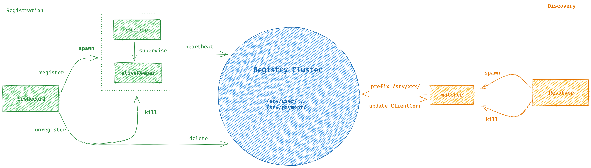

# Discov

[中文文档](./README_CN.md)

Discov is a generic gRPC service registration and discovery / load balancing component.

## Supported Scenarios

- The scenario of etcd as the service registry.
- The scenario of using headless service as DNS name to discover services in Kubernetes cluster.
- The scenario of DNS as a service registry.

## Architecture

## Examples

- [Etcd Scenario](./examples/etcd)
- [Kubernetes Scenario](./examples/k8s)

## Documentation

[pkg.go.dev](https://pkg.go.dev/github.com/xvrzhao/discov)

## License

[MIT License](./LICENSE)